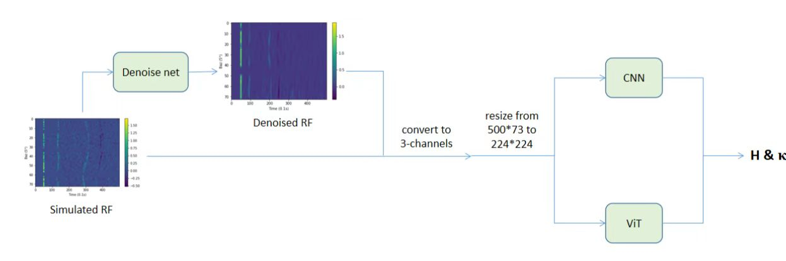

# Vision Transformer-Based H-k Method(HkViT) for Predicting Crustal Thickness and Vp/Vs Ratio from Receiver Functions ——Final project for [computer vision (04835030)](https://pku.vision/course/) at PKU

Our report are posted in the Respository, our video will soon be released [here](https://pku.vision/course/22fall/final_project/)
<div align=center>

</div>
Crustal thickness (H) and crustal Vp/Vs ratio k are fundamental parameters for regional geology and tectonics. 

The teleseismic receiver function (RF) is the response of the Earth structure below a seismometer to an incident seismic wave. It is commonly used to determine major interfaces of the Earth, including 
the above two parameters.

Up to now, a deep learning-based H-k Method (HkNet) has been proposed with higher accuracy and more stable results comparing to H-k-c method. However, there are still quite large room for HkNet to improve its accuracy and robustness. Here we propose a new method which uses Vision Transformer (ViT) to estimate H and k.

Our model can be divided into two parts. The first part is set to denoise the receiver functions, while the second part uses ViT to predict H and with denoised RFs being its input.
Synthetic data tests and real data both show that our new method obtains great accuracy and robustness.

 ***Feel free to contact us through [email](2000016625@stu.pku.edu.cn) if you have any questions!***


## Dependencies:
+ Python 3.8
+ PyTorch
+ torchvision
+ timm
+ vit_pytorch
+ tqdm
+ pandas

## Usage
### 1. Download Reciever Function data

* [Get RF data from this link](https://drive.google.com/drive/folders/1XxPv8hohp3doclVKzAg1Mfz6qbu_Lr_W?usp=sharing)


### 2. Install required packages

Install dependencies with the following command:

```bash
pip3 install -r requirements.txt
```

### 3. Change root

you might need to adapt root for data in Dataset.py

### 4. Train
To train our model and Denoise net:

```bash
python main.py
```

you could change config through parameters of train_reg、train_denoise in main.py

